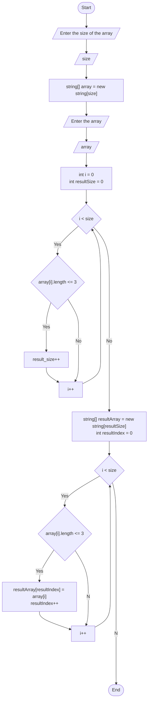

# Итоговая проверочная работа

## Блок-схема

## Решение задачи

### Условие

Написать программу, которая из имеющегося массива строк формирует массив из строк, длина которых меньше либо равна 3 символа. Первоначальный массив можно ввести с клавиатуры, либо задать на старте выполнения алгоритма.

### Алгоритм действий

1. Считываем массив с клавиатуры.
2. Узнаем размер второго массива - считаем количество строк длинной меньше или равной трем символам.
3. Создаем второй массив.
4. Заполняем второй массив.